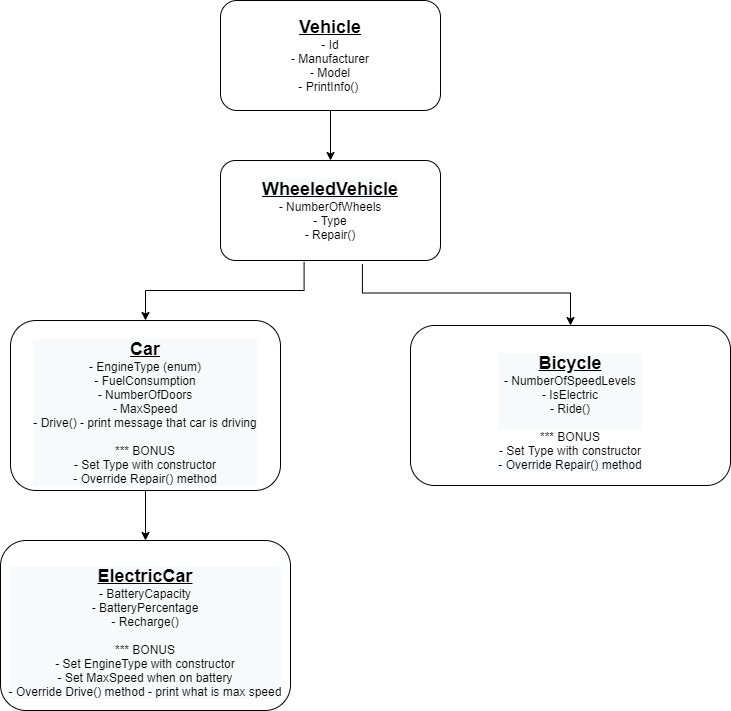

# Inheritance Homework 🎉

 - ### Create the inheritance chain as described on image above ☝🏻 
 - ### Every class should have the required properties and methods
 - ### Regarding the method implementation use your creativity and imagination 🐱‍👤
 - ### Don't forget to structure the code following the good practices we mentioned
 - ## Create electric and fuel cars, bicycles, drive them and recharge/refuel them with both correct and incorrect values, check if battery usage and current fuel properties return correct values 😎
 
 
## Don't hesitate to contact us for clarification of the requirements on the well known communication channels ✔
